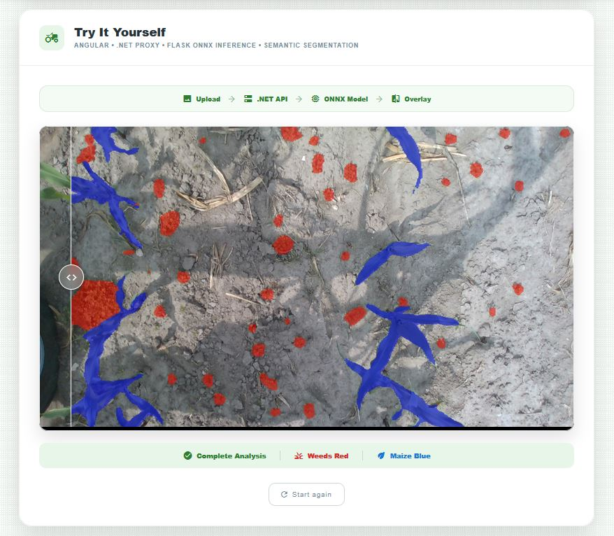
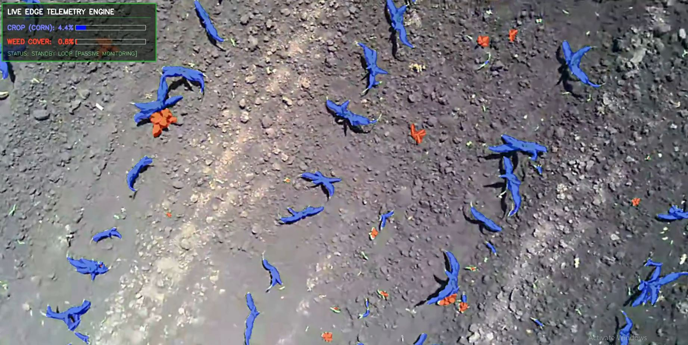
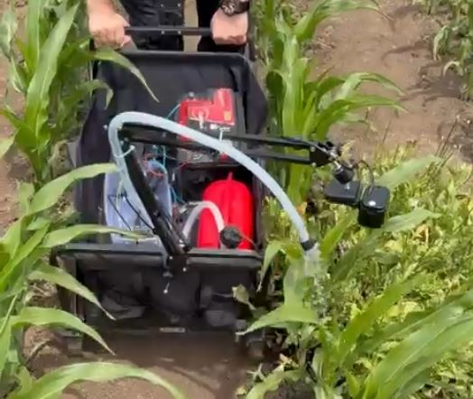
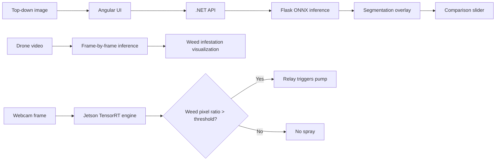
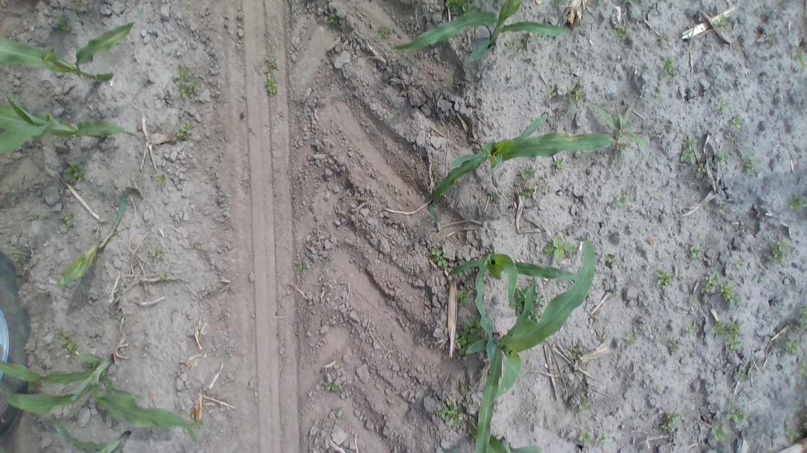
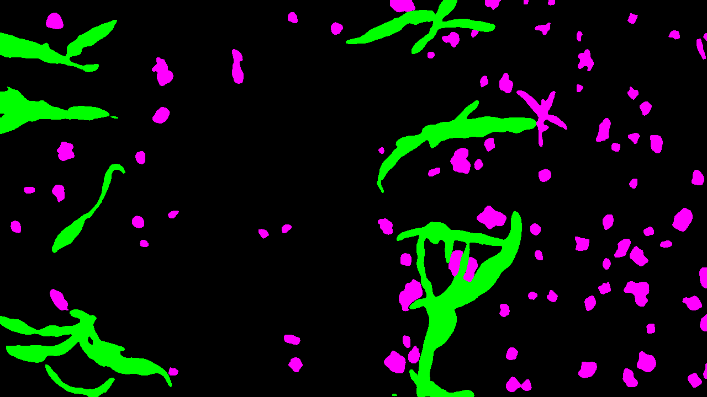
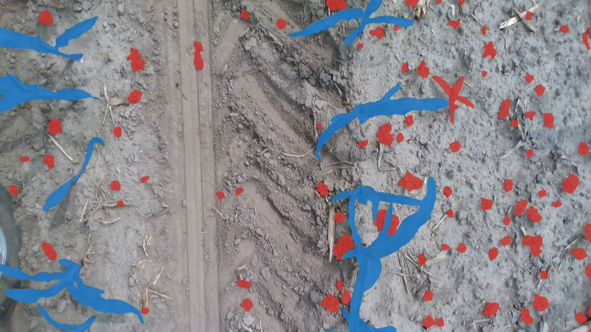
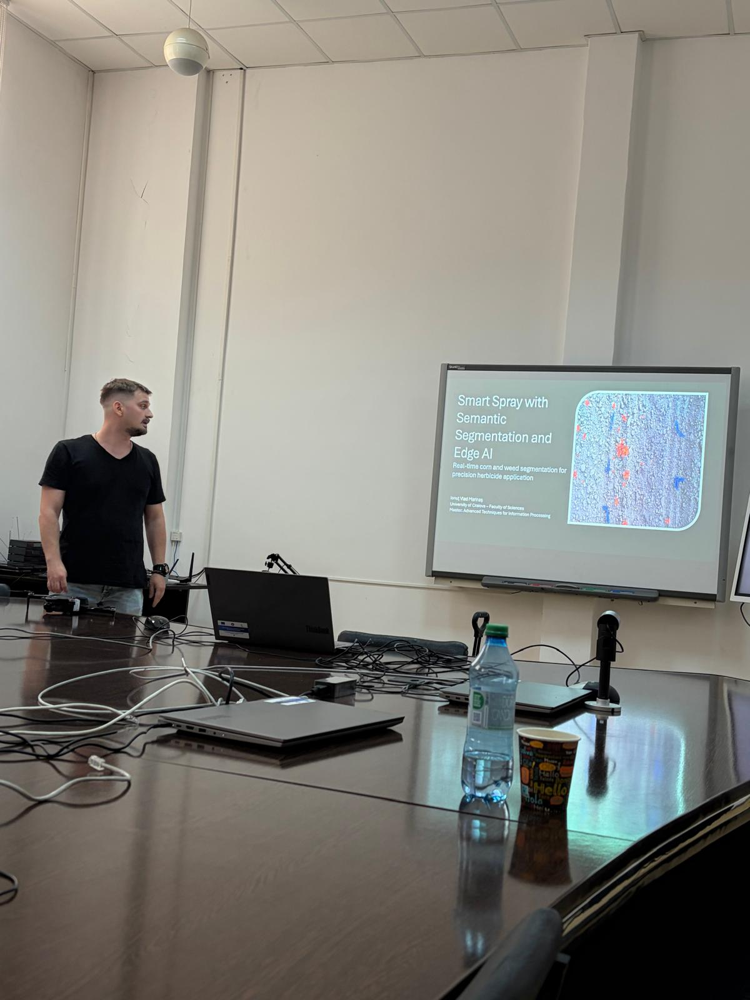

# Smart Spray Edge AI

Award-winning Computer Vision and Edge-AI system for maize/weed semantic segmentation, drone field mapping, and Jetson-based selective spraying.

🏆 **1st Place** — 18th Student Scientific Communications Session
🌐 **Live demo:** https://marinashub.ro/weeds
🧠 **Tech stack:** PyTorch, OpenCV, SegFormer, ONNX, TensorRT, Flask, .NET, Angular, NVIDIA Jetson

---

## Overview

Smart Spray Edge AI is an applied Computer Vision project for detecting maize and weeds in top-down field images using semantic segmentation.

The project demonstrates how a segmentation model can be used in three real-world deployment scenarios:

1. **Web inference demo** using Angular, .NET and Flask/ONNX.
2. **Drone field mapping** for weed infestation visualization.
3. **Edge-AI smart spraying prototype** using NVIDIA Jetson Orin Nano Super, webcam, relay and pump control.

The goal is to move from simple weed detection toward real-time selective spraying, where herbicide is applied only when weed presence is high enough.

---

## Demo



**Live demo:** https://marinashub.ro/weeds

The web demo allows users to upload a top-down maize/weed image and compare the original image with the AI-generated segmentation overlay using an interactive before/after slider.

---

## Why This Project Matters

Herbicide is often applied uniformly across fields, even though weeds are not uniformly distributed. This leads to:

* unnecessary chemical usage;
* higher operational costs;
* increased environmental impact.

Smart spraying can reduce herbicide usage by detecting where weeds are present and triggering spraying only in those areas.

This project explores a lower-cost approach using semantic segmentation and edge AI.

---

## Dataset Challenge

Public top-down maize/weed pixel-wise segmentation datasets are limited. Most available datasets are small, inconsistent, or do not contain realistic maize and weed mixtures in the same image.

To solve this, I assembled and processed a custom dataset of **16,000+ top-down field images** with pixel-wise masks for three classes:

* `background`
* `maize`
* `weeds`

For datasets that only had bounding box annotations, I generated semantic segmentation masks using:

* HSV-based green filtering;
* binary thresholding;
* morphological opening and closing;
* connected components;
* dataset-specific calibration;
* SAM-assisted mask refinement.

More details: [Dataset Pipeline](docs/dataset-pipeline.md)

---

## Model

The model was trained for green-on-green semantic segmentation of maize and weeds.

**Architectures tested:**

* U-Net with ResNet34 encoder
* SegFormer B5

**Training details:**

* Input size: `1024x1024`
* Classes: background, maize, weeds
* Augmentation: Albumentations
* Losses: Dice Loss, Focal Loss, Cross Entropy
* Optimizer: AdamW
* Metrics: IoU and foreground mIoU

---

## Results

| Test set    | Images | Maize IoU | Weed IoU | Foreground mIoU |
| ----------- | -----: | --------: | -------: | --------------: |
| Same-domain |    285 |    0.9379 |   0.7275 |          0.8327 |
| Weedsgalore |    156 |    0.6910 |   0.5319 |          0.6114 |

The model achieved strong same-domain performance and was also evaluated on an external dataset to measure generalization under domain shift.

---

## Deployment 1: Web Inference


The web application uses a distributed architecture:

```text
Angular UI → .NET Backend → Flask ONNX API → Segmentation Overlay → Comparison Slider
```

Flow:

1. The user uploads an image through the Angular interface.
2. Angular sends the image to the .NET backend.
3. The .NET backend forwards the image to a Flask API.
4. The Flask API runs ONNX inference.
5. The prediction is returned as an overlay image.
6. Angular displays the original and predicted overlay with a comparison slider.

The PyTorch model was exported to ONNX to make deployment lighter and more suitable for low-cost hosting.

---

## Deployment 2: Drone Field Mapping



The model was also applied to drone footage captured over a maize field.

Because drone footage introduced a different visual domain, I manually annotated 50 drone frames in CVAT and used them for a short fine-tuning step. This improved adaptation to the drone video domain.

The processed video can be used to visualize:

* maize coverage;
* weed coverage;
* frame-by-frame segmentation overlays;
* potential weed infestation heatmaps.

---

## Deployment 3: Edge-AI Smart Spray Prototype



The model was deployed on an **NVIDIA Jetson Orin Nano Super** for real-time edge inference.

The prototype includes:

* NVIDIA Jetson Orin Nano Super;
* webcam;
* TensorRT inference engine;
* relay module;
* pump;
* external batteries;
* cart chassis.

The model pipeline was converted as:

```text
PyTorch checkpoint → ONNX model → TensorRT engine
```

At runtime:

```text
Webcam frame → TensorRT inference → Weed pixel ratio → Threshold decision → Relay/Pump trigger
```

The system ignores maize and triggers spraying only when the weed pixel ratio exceeds a configured threshold.

---

## Architecture



---

## Repository Contents

```text
smart-spray-edge-ai/
  README.md
  requirements.txt
  .gitignore

  assets/
    web-demo.JPG
    drone-mapping.JPG
    jetson-cart.JPG
    award.jpg
    demo-original.jpg
    demo-mask.png
    demo-overlay.jpg

  src/
    create_overlay.py
    smart_spray_decision.py

  docs/
    dataset-pipeline.md
    deployment-notes.md
```

---

## Scripts

### `src/create_overlay.py`

Creates visualization overlays from segmentation masks.

The script takes:

* an original image;
* a color-coded segmentation mask;
* an output path.

It then creates a visual overlay where:

* maize is highlighted in blue;
* weeds are highlighted in red;
* background remains unchanged.

Run:

```bash
python src/create_overlay.py --image assets/demo-original.jpg --mask assets/demo-mask.png --output assets/demo-overlay.jpg
```

Expected input files:

```text
assets/demo-original.jpg
assets/demo-mask.png
```

Generated output:

```text
assets/demo-overlay.jpg
```

### Overlay Example

Original image:



Color-coded segmentation mask:



Generated overlay:



---

### `src/smart_spray_decision.py`

Contains the simplified decision logic for triggering spraying based on weed pixel ratio.

The script demonstrates the core idea behind the Jetson prototype:

```text
semantic segmentation mask → weed pixel ratio → threshold decision → spray / no spray
```

Run:

```bash
python src/smart_spray_decision.py
```

Example output:

```text
Prediction summary:
- background_ratio: 0.8194
- maize_ratio: 0.1367
- weed_ratio: 0.0439

Spray decision: True
Weed ratio: 0.0439
```

> Note: `export_to_onnx.py` and `video_inference.py` will be added later as deployment examples.

---

## Limitations

This is a research prototype, not an industrial spraying product.

Current limitations:

* domain shift between datasets, fields, cameras and lighting conditions;
* small weeds can be missed;
* spray threshold requires field calibration;
* prototype is not industrial-grade;
* full dataset and model weights are not included due to licensing and file size constraints.

---

## Future Work

Planned improvements:

* more real field testing;
* better weed recall under domain shift;
* nozzle-level control and timing calibration;
* quantitative herbicide reduction experiments;
* RGB vs multispectral comparison;
* larger drone-based evaluation.

---

## Award



This project won **1st place** at the 18th Student Scientific Communications Session organized under the University of Craiova.

The project was recognized for combining applied Computer Vision research with real-world deployment through web inference, drone footage processing and Jetson-based edge-AI spraying.

---

## Contact

**Vlad Marinas**

* Live demo: https://marinashub.ro/weeds
* GitHub: https://github.com/marinasvlad
